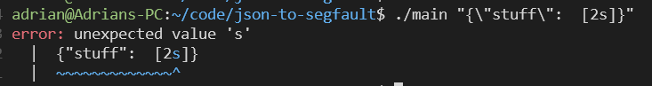

# json-to-segfault

I've never coded in C before this, as I'm sure you can tell. But this is just me hacking away, creating memory bugs and enjoying it more than I should.. and no it does not meet the entire JSON specification.

